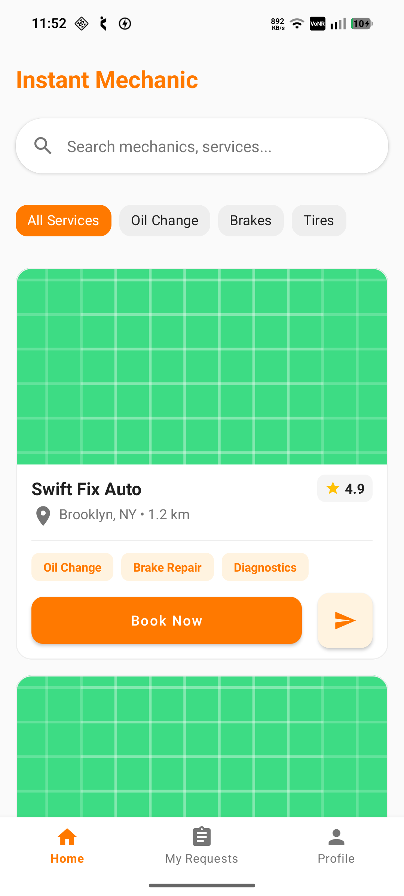
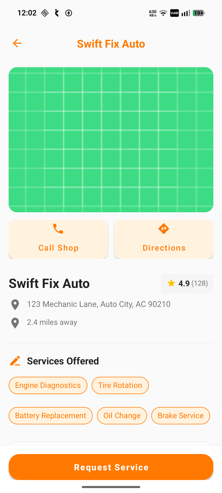
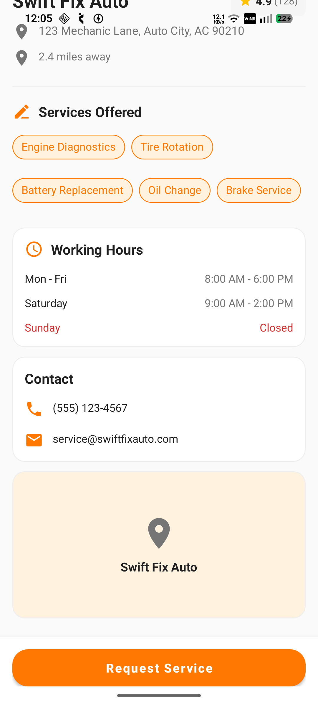
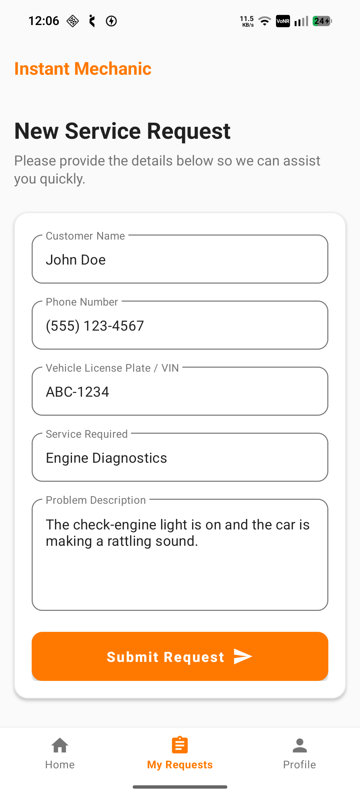

# Instant Mechanic

Instant Mechanic is an Android mechanic booking app that helps users quickly find nearby auto repair shops, browse services like oil change, brakes and diagnostics, view ratings, working hours and contact details, and submit service requests in seconds. Built with Kotlin, Fragments, Retrofit, Hilt and Material 3 with edge-to-edge UI.

## Screenshots

|  |  |  |  |
